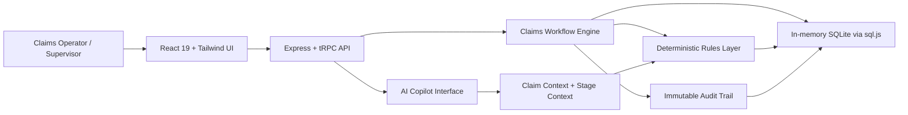

# OperaAI Claims Intelligence

## Agentic Workflow Demo for Regulated Insurance Operations

> **By Vijayendra Dwari**  
> A reference implementation of an agentic workflow system for Singapore health insurance claims processing.

OperaAI Claims Intelligence demonstrates how enterprise AI can be designed for regulated environments where automation must be explainable, auditable, and human-accountable. It moves beyond chatbot-style AI and shows how AI can operate inside a structured claims workflow with clear queues, deterministic compliance logic, human-in-the-loop control, and immutable audit trails.

---

## Why This Matters

Most enterprise AI deployments fail in insurance claims processing because they treat AI as a standalone tool instead of a workflow participant. A health insurance claim is not a simple Q&A task. It is a regulated state machine governed by identity validation, medical assessment, payout rules, SLA requirements, auditability, and privacy constraints.

In Singapore, a health insurance claim must navigate:

- **MAS Notice 120**: SLA discipline, decision rationale, and auditability.
- **MOH Schedule of Fees**: Benchmark comparison and proration where provider charges exceed fee guidance.
- **CPF Medisave & MediShield Life**: Eligibility and financing-route validation.
- **PDPA**: Data minimisation, consent tracking, and controlled communications.

A generic LLM cannot process a claim safely. An **agentic workflow system** can.

---

## What This Repository Demonstrates

OperaAI Claims Intelligence is a demo-optimized but production-inspired application showing how regulated insurance operations can be structured as a human-governed agentic workflow.

### Core architectural patterns

1. **Multi-persona queue routing**  
   The workflow is divided into six operational stages: Lodgement, Assessment, Medical, Decisioning, QC, and Payment. Each stage represents a distinct role, authority boundary, and transition condition.

2. **Human-in-the-loop AI Copilot**  
   The AI Copilot assists the operator with contextual checks, regulatory explanation, document reasoning, benchmark calculations, payout recommendations, and communication drafts. It does not independently approve or pay claims.

3. **Deterministic + probabilistic hybrid architecture**  
   Deterministic code handles regulated calculations such as co-insurance, payout logic, queue transitions, and audit recording. Probabilistic AI assists with unstructured reasoning, clinical context, document completeness, and user guidance.

4. **Immutable audit trail pattern**  
   Every material action is logged with actor, stage, timestamp, rationale, and outcome to support compliance review and post-decision traceability.

5. **Resettable demo state**  
   The in-memory SQLite design enables a clean, repeatable demo. The application can be reset instantly to the original seeded claims.

---

## Architecture Overview



For a deeper architecture explanation, see [`docs/ARCHITECTURE_OVERVIEW.md`](docs/ARCHITECTURE_OVERVIEW.md).

---

## The Six-Stage Agentic Workflow

The demo includes seven seeded claims distributed across the workflow to show different capabilities and exception paths.

| Stage | Agentic capability demonstrated | Regulatory / operational context |
|---|---|---|
| **1. Claim Lodgement** | Minimum requirements validation and intake triage | Singpass identity verification |
| **2. Claim Assessment** | Concurrent workspace for eligibility and policy review | CPF Medisave & MediShield Life validation |
| **3. Medical & Requirements** | Fee benchmark and clinical necessity checks | MOH Schedule of Fees proration |
| **4. Claim Decisioning** | Rules-driven payout calculation and decision rationale | MAS Notice 120 decision traceability |
| **5. QC & Decision Comms** | SLA tracking, QC review, and communication drafting | PDPA compliance and MAS audit trail |
| **6. Payment & Closure** | Payment routing, reconciliation, and closure | FAST transfer and Medisave routing |

For suggested walkthroughs, see [`docs/DEMO_SCENARIOS.md`](docs/DEMO_SCENARIOS.md) and [`LIVE_DEMO_SCRIPT.md`](LIVE_DEMO_SCRIPT.md).

---

## Demo Highlights

| Scenario | What to show | Why it matters |
|---|---|---|
| P1 Critical Illness claim | Eligibility checks, document completeness, MOH benchmark, payout calculation | Shows full lifecycle automation with human checkpoints |
| MOH benchmark analysis | Claimed amount vs benchmark, excess amount, proration logic | Shows deterministic compliance logic around medical fees |
| MAS SLA check | Business-day SLA status and decision rationale | Shows audit-readiness for regulated operations |
| Settlement letter draft | AI-assisted claimant communication | Shows productivity without surrendering human authority |
| Reset Demo | One-click database reset | Shows repeatable demo design and developer productivity |

---

## Screenshots and Demo Assets

Add screenshots or a short GIF under `docs/assets/` to make the repository more compelling for recruiters, stakeholders, and reviewers.

Recommended assets:

- `docs/assets/dashboard.png` — Dashboard with queue counts and stat cards.
- `docs/assets/claim-detail.png` — Claim detail page with AI Copilot visible.
- `docs/assets/moh-benchmark.png` — MOH fee benchmark / proration response.
- `docs/assets/audit-trail.png` — Audit trail after a stage transition.
- `docs/assets/demo-walkthrough.gif` — 60–90 second walkthrough of the claim lifecycle.

Suggested README embed once assets are added:

```md


```

---

## Technical Stack

This is a lightweight, demo-optimized stack designed to run entirely in memory for easy presentation and resetting.

- **Frontend:** React 19 + TailwindCSS 4
- **Backend:** Express 4 + tRPC 11
- **Database:** SQLite via `sql.js` running in memory
- **Language:** TypeScript
- **UI pattern:** Dark navy sidebar optimized for enterprise data density

> The in-memory SQLite setup allows the demo to be reset instantly to the original seven seeded claims.

---

## Getting Started

### Prerequisites

- Node.js 22+
- pnpm

### Installation

```bash
# Clone the repository
git clone https://github.com/VijayendraDwari/operaai-claims-intelligence.git
cd operaai-claims-intelligence

# Install dependencies
pnpm install

# Start the development server
pnpm run dev
```

The application will be available at:

```text
http://localhost:5173
```

---

## Running the Demo

1. Open the application and navigate to the **Claim Lodgement** queue.
2. Open claim `CLM-2026-001` or follow the P1 Critical Illness walkthrough in `LIVE_DEMO_SCRIPT.md`.
3. Use the AI Copilot panel to ask: `check eligibility requirements`.
4. Review the Copilot response and stage-specific validation output.
5. Click **Advance to Next Stage** to move the claim.
6. Inspect the audit trail entry generated by the transition.
7. Click **Reset Demo** in the sidebar to restore all seven seed claims.

---

## Why This Is Enterprise-Relevant

This project is intentionally designed around patterns that matter in regulated enterprise AI:

- **Human accountability:** AI advises; humans approve.
- **Auditability:** every meaningful event is traceable.
- **Deterministic control:** regulated calculations are rules-based.
- **Workflow ownership:** claims move through explicit operational states.
- **Explainability:** recommendations are tied to stage, context, and rationale.
- **Demo repeatability:** seeded data and resettable state make the app easy to present.

These patterns generalize beyond insurance to healthcare, banking, financial services, legal operations, public sector workflows, and compliance-heavy enterprise processes.

---

## Production Upgrade Path

This repository is demo-optimized. A production implementation would typically add:

- Persistent PostgreSQL or cloud database storage.
- Authentication and role-based access control.
- Real document ingestion and OCR / IDP pipelines.
- Integration with policy admin, CPF, MediShield, payment, and notification systems.
- Configurable workflow definitions and transition policies.
- Queue-level SLAs, escalation rules, and supervisory dashboards.
- Model gateway for hosted or private LLM providers.
- Observability, monitoring, and compliance reporting.

---

## About the Author

**Vijayendra Dwari** is an architect of enterprise agentic systems. He specializes in building AI systems for regulated industries including insurance, healthcare, financial services, and compliance operations where auditability, deterministic control, and human-in-the-loop governance are essential.

[LinkedIn](https://linkedin.com/in/vijayendradwari) | [GitHub](https://github.com/VijayendraDwari)

---

© 2026 Vijayendra Dwari. Open-sourced under the MIT License.
