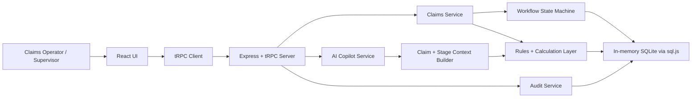

# OperaAI Claims Intelligence — Architecture Overview

OperaAI Claims Intelligence is a reference architecture for agentic claims processing in regulated insurance operations. The application is intentionally lightweight for demo use, but it is structured around patterns that map cleanly to production systems.

---

## Architectural Intent

The system demonstrates a core enterprise AI principle:

> AI should not replace the workflow. AI should operate inside the workflow with clear authority boundaries, audit trails, and human checkpoints.

The application therefore combines:

- A stage-based claims workflow.
- Human-in-the-loop queue transitions.
- AI Copilot support for contextual reasoning.
- Deterministic rules for regulated decisions and calculations.
- Immutable audit trail capture for review and compliance.
- Seeded demo data for repeatable stakeholder walkthroughs.

---

## Logical Architecture

---

## Major Components

### 1. React Frontend

The frontend presents the claims operation as a queue-driven workspace. It includes:

- Dashboard summary cards.
- Six queue views mapped to the claims lifecycle.
- Claim detail workspace.
- AI Copilot panel.
- Workflow progress indicator.
- Audit trail viewer.
- Reset demo control.

The UI is intentionally dense and enterprise-oriented, using a dark navy sidebar to make operational state visible during demos.

### 2. Express + tRPC Backend

The backend exposes typed APIs for claims, workflow actions, Copilot responses, and demo reset behavior. tRPC keeps the full stack TypeScript-native and reduces integration friction between the React client and server.

### 3. Claims Workflow Engine

The workflow engine controls stage progression. It models claims as work items moving through fixed operational states:

1. Claim Lodgement
2. Claim Assessment
3. Medical & Requirements
4. Claim Decisioning
5. QC & Decision Communications
6. Payment & Closure

Each transition is explicit and human-triggered. This is important for regulated operations because the system preserves accountability even where AI is providing recommendations.

### 4. AI Copilot Interface

The Copilot is designed as a stage-aware assistant, not an autonomous decision-maker. It reads the current claim state and responds with relevant guidance, such as:

- Eligibility checks.
- Missing document analysis.
- CPF / MediShield validation guidance.
- MOH fee benchmark reasoning.
- Payout calculation explanation.
- MAS SLA status.
- Settlement communication drafts.
- Payment and closure guidance.

The demo may use seeded or mocked responses, but the architectural pattern is compatible with hosted LLMs, private LLM gateways, retrieval-augmented generation, and enterprise knowledge bases.

### 5. Deterministic Rules Layer

Regulated decisioning should not be left to a probabilistic model. The deterministic layer handles calculations and rule checks that must be auditable, repeatable, and defensible, including:

- Co-insurance calculation.
- Fee benchmark comparison.
- Payout logic.
- Stage transition validation.
- SLA status checks.
- Audit event creation.

### 6. Immutable Audit Trail

The audit layer records material workflow events. A production version would typically make the audit log append-only at the database or event-store layer.

Typical audit attributes include:

- Claim ID.
- Stage.
- Action type.
- Actor.
- Timestamp.
- Rationale.
- Outcome.
- Previous and next state.

### 7. In-Memory SQLite Store

The demo uses SQLite via `sql.js` in memory to support instant reset and presentation repeatability. This is intentionally optimized for demos, not production persistence.

---

## Design Principles

### Human authority remains explicit

The AI Copilot can recommend, explain, and draft, but the human operator advances the claim and remains accountable for the decision.

### Compliance logic is deterministic

Regulated calculations and hard rules are implemented as deterministic logic rather than free-form AI outputs.

### AI is context-aware

The Copilot is grounded in the current claim, current queue, and current stage requirements. It is not a generic chatbot placed next to a workflow.

### Every decision should be reviewable

Auditability is treated as a first-class architecture concern, not a reporting afterthought.

### The demo should be reproducible

The system can be reset to the original seven seeded claims, making it suitable for repeated demos, workshops, and engineering walkthroughs.

---

## Production Extension Path

A production implementation would typically replace or extend the demo components as follows:

| Demo component | Production-grade equivalent |
|---|---|
| In-memory SQLite | PostgreSQL, Aurora, Cloud SQL, or SQL Server |
| Mock/seeded Copilot responses | LLM gateway with retrieval, guardrails, and evaluation |
| Manual demo reset | Environment seeding and test fixtures |
| Local Express server | Containerized service or serverless API layer |
| Static workflow stages | Configurable workflow engine / BPM layer |
| Basic audit log | Append-only event store and compliance reporting |
| Local-only operation | Auth, RBAC, SSO, secrets management, and monitoring |

---

## Why This Pattern Generalizes

Although the demo is focused on Singapore health insurance claims, the same architecture applies to other regulated workflows:

- Healthcare prior authorization.
- Banking KYC / AML review.
- Sanctions compliance screening.
- Legal document review.
- Public sector benefits processing.
- Insurance enrollment and policy servicing.
- Financial dispute resolution.

The reusable pattern is: **workflow state machine + deterministic controls + contextual AI Copilot + human approval + audit trail**.
